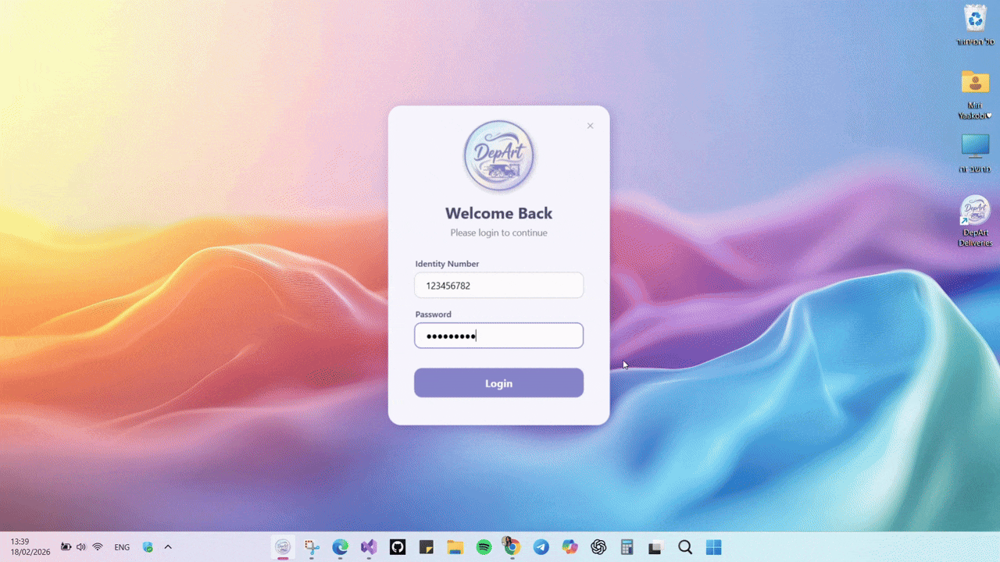
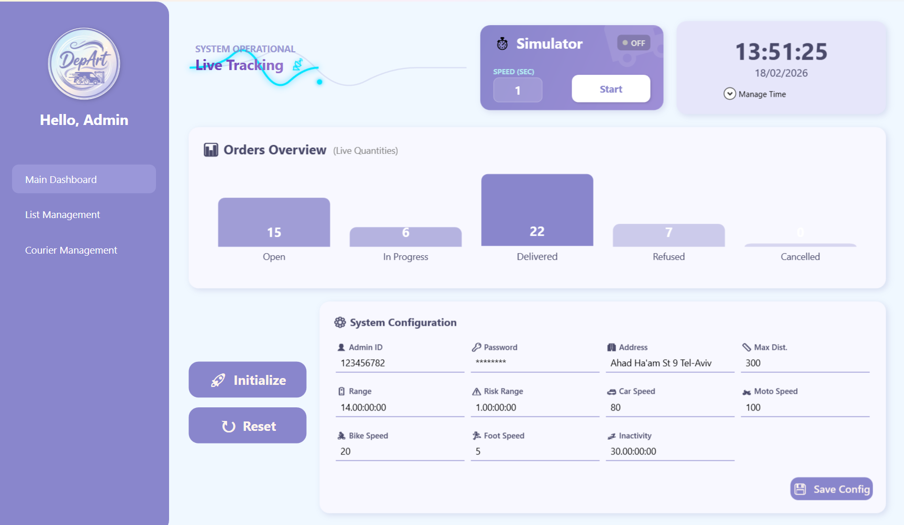
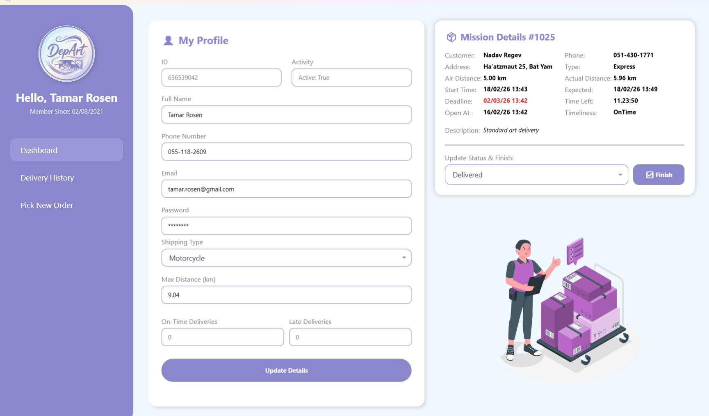

<div align="center">

# 🎨 DepArt | Fine Art Logistics
### "Delivering Masterpieces with Precision."


</div>

---



### 📺 [Click Here to Watch the Full Video Demo (1:35 min)](https://youtu.be/Zayb3Yz2wZY)

---

## 📖 About The Project
**DepArt** is a specialized logistics solution tailored for high-end Art Galleries.
Transporting art requires more than just speed; it requires care. We built a system that manages the delicate process of delivering valuable assets from the gallery to the collector.

The system utilizes a **smart algorithm** to match the optimal courier to the package based on **real-time distance** and **vehicle capability** (Car, Motorcycle, Bicycle, or Foot).

### 📸 Gallery (Screenshots)
| Manager Dashboard | Courier Profile |
|:---:|:---:|
|  |  |

---

## ✨ Key Features & Highlights
* **The "God Mode" Simulator:** Experience the system in action! The simulator runs on a separate thread (**Multi-Threading**), creating a lifelike environment where time moves faster, and orders are dispatched automatically based on courier availability.
* **Vehicle Logic:** The system calculates delivery times based on the courier's transport mode (Car vs. Bicycle).
* **Real-Time Email Notifications:** Unlike standard apps, DepArt integrates with **SMTP servers** to send automatic email confirmations when a parcel is delivered or when a critical alert is triggered.
* **Safe-Delete Logic:** You cannot delete a courier who is currently carrying a Mona Lisa! 🖼️
* **Smart Grouping:** Advanced filtering of orders by status and area using `CollectionViewSource`.

---

## 💻 Tech Stack
* **Language:** C#
* **Framework:** .NET 8.0
* **UI:** Windows Presentation Foundation (WPF)
* **Architecture:** 3-Tier Layered Architecture, MVVM & Commands
* **Data:** XML Serialization, LINQ

---

## 🏗️ Architecture
The system follows a strict **3-Tier Layered Architecture** to ensure separation of concerns:
* **PL (Presentation Layer):** A responsive UI built with WPF and MVVM that reacts to data changes instantly.
* **BL (Business Logic):** Manages the core operations, smart algorithms, and the background simulator threads.
* **DAL (Data Access Layer):** Handles data persistence using XML Serialization and the Factory pattern.

*(The layers communicate strictly downwards: PL -> BL -> DAL).*

---

## 🚀 Getting Started

### Prerequisites
* Visual Studio 2022 (or newer)
* .NET 8.0 SDK

### Installation & Configuration

> ⚠️ **Security Notice:** This project uses external services (LocationIQ & Gmail SMTP).
> For security reasons, the API keys are **not** included in the repository. Follow the steps below to configure your local environment.

1. Clone the Repository:
```bash
git clone https://github.com/MiriYaakobi/DepArt_Project.git
cd DepArt_Project
```

2. Configure the "Secrets":
We use a secure method to handle API keys and Passwords without exposing them to Git.
* Navigate to `BL` -> `Helpers`.
* Locate the file: `Secrets.Template.cs`.
* **Create a copy** of this file and rename it to `Secrets.cs`.
* Update the fields with your own credentials:

```csharp
internal static class Secrets
{
    // 1. Map & Distance Service (Get free token from LocationIQ.com)
    internal const string LocationIqApiKey = "YOUR_LOCATIONIQ_KEY_HERE";

    // 2. Email Notification Service (Gmail App Password)
    internal const string ServiceEmail = "your.project.email@gmail.com";
    internal const string ServicePassword = "xxxx xxxx xxxx xxxx"; 
}
```

3. Run the System:
* Set **PL** as your startup project in Visual Studio and hit **F5**!

---

## 🔑 How to Log In (API / Usage)

The system comes pre-loaded with data so you can start testing immediately.

### 👨‍💼 Manager Access (Headquarters)
* **User ID:** `123456782`
* **Password:** `Deafult1234$`

### 🚚 Courier Access (Field)
To test the courier interface:
1. Log in as a **Manager** first.
2. Go to the **"Couriers"** tab and click **Add Courier**.
3. Create a new courier profile.
4. Log in using the **ID** and **Password** you just created.

---

## 📂 Project Structure
```text
DepArt_Project/
├── DAL/          # Data Access Layer (XML data, Data sources)
├── BL/           # Business Logic (Managers, Entities, Simulator)
├── BL/Helpers/   # Secrets and configuration files
├── PL/           # Presentation Layer (WPF Windows, ViewModels)
└── Images/       # Assets and Demo media
```

---

## 🧠 What We Learned
Building this system taught us the critical importance of **structured software engineering** - progressing through clear, logical development stages from initial data modeling to the final UI integration. 

Our most significant technical challenge was the "God Mode" Simulator. We learned how to effectively manage **Background Threads** for real-time delivery simulations and safely synchronize them with the main UI thread using the **WPF Dispatcher**. This hands-on experience highlighted the vital role of asynchronous programming in keeping the UI fully responsive while enforcing strict state-validation rules in the background.

---

## 👩‍💻 Developed By

<div align="center">

**Miri**
<br>
[](https://www.linkedin.com/in/miri-yaakobi-868790388/) [](https://github.com/MiriYaakobi)

<br>

**Odelia**
<br>
[](https://www.linkedin.com/in/odelyagil/) [](https://github.com/OdelyaGil)

</div>

---
<div align="center">
Developed as a final project for Windows Application Programming Course, JCT.
</div>